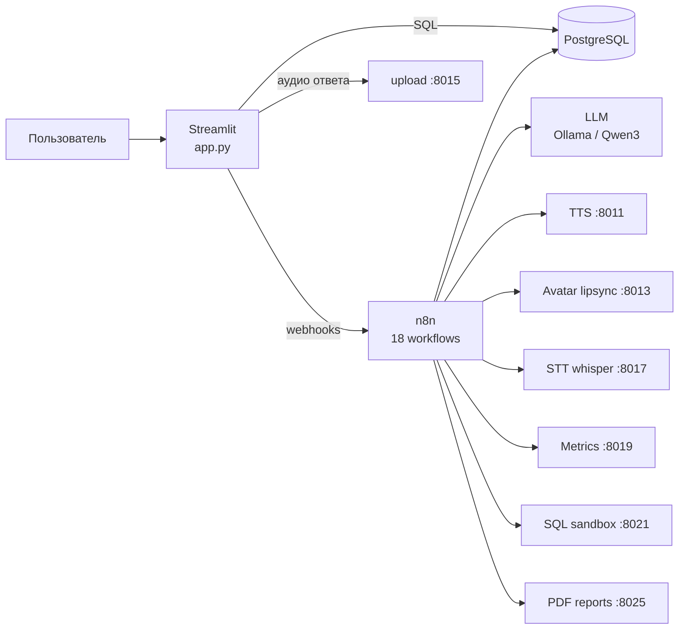
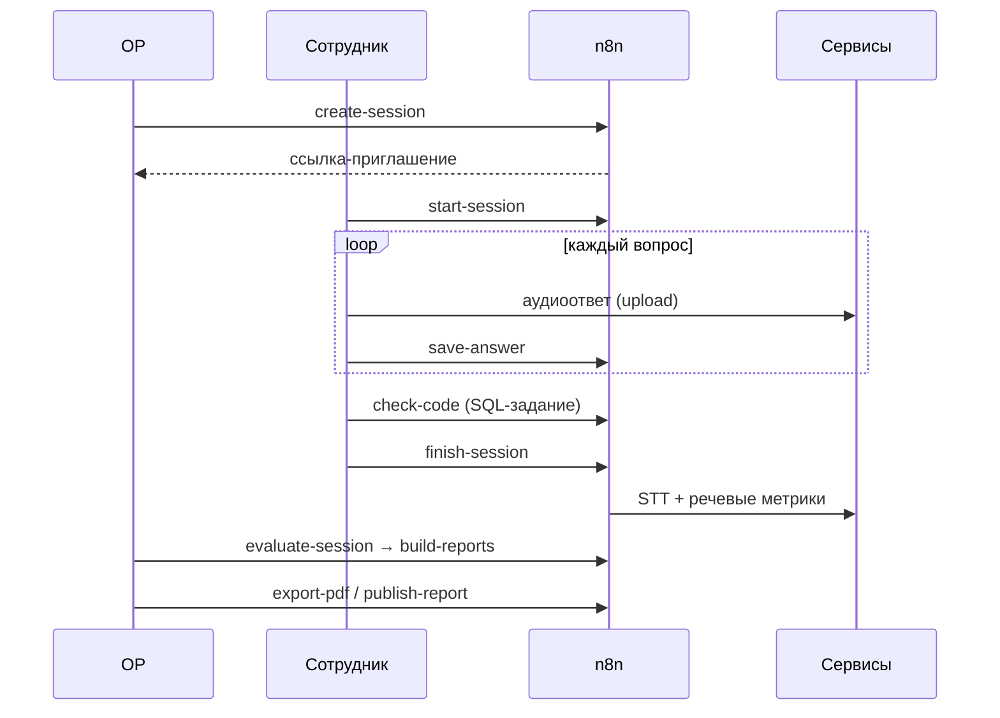

# МеМАС — мультимодальная агентная система оценки компетенций


Система проводит **AI-собеседования с сотрудниками** и оценивает их компетенции. Вопросы генерирует LLM на основе внутреннего гайдбука. Видеоаватар задаёт их голосом, сотрудник отвечает вслух и решает практическое SQL-задание. Затем ответы транскрибируются, анализируются и оцениваются, а система строит отчёты для руководителя и сотрудника.

> Оркестрация построена на **n8n**: 18 workflow, LLM-цепочки, вебхуки. Медиаобработка разнесена по микросервисам на **FastAPI**, интерфейс написан на **Streamlit**, данные хранятся в **PostgreSQL**.

---

## Возможности

**Подготовка контента**
- Парсинг гайдбука компетенций (Excel) и раскладка по таблицам: компетенции, задачи, принципы
- Генерация вопросов для собеседования через LLM (Qwen3-32B / Llama 3): теоретические и практические, с эталонным ответом
- Ревью вопросов человеком: одобрить, отклонить или отредактировать
- Медиа-батч: озвучка вопросов (TTS) и генерация видео говорящего аватара с липсинком

**Собеседование**
- Бронирование слотов в календаре, приглашение сотрудника по одноразовой ссылке-токену
- «Комната» собеседования: аватар задаёт вопрос, сотрудник записывает аудиоответ
- Практическое задание на SQL. Код выполняется в песочнице с белым списком таблиц и фильтром опасных конструкций
- Тренировочный режим: сотрудник запускает пробную сессию сам

**Оценка и отчётность**
- Распознавание речи (faster-whisper) и речевые метрики: темп (слов/мин), количество и длительность пауз, громкость
- LLM-оценка ответов относительно эталона: уровень владения компетенцией по шкале 1–5, поиск «красных флагов»
- Три уровня отчёта: транскрипция, отчёт для руководителя, обратная связь сотруднику
- Экспорт в PDF и публикация отчёта
- Аналитика: прогресс по компетенциям во времени, дельта между сессиями
- Автоматические напоминания по расписанию

## Роли

| Роль | Что делает |
|---|---|
| **Ответственный за развитие (ОР)** | назначает собеседования, проверяет оценки, публикует отчёты, смотрит аналитику |
| **Ассистент** | ведёт календарь слотов и бронирует время |
| **Сотрудник** | проходит собеседования и тренировки, видит свои компетенции и обратную связь |
| **Администратор** | управляет пользователями, видит состояние системы |

## Архитектура



**Жизненный цикл собеседования:**



## Стек

| Слой | Технологии |
|---|---|
| Интерфейс | Streamlit, Pandas, Plotly, кастомный CSS |
| Оркестрация | n8n (webhooks, LLM chains, schedule/form triggers) |
| LLM | Ollama (Llama 3 8B, Llama 3.2 3B), Qwen3-32B-AWQ через OpenAI-совместимый API |
| Речь | faster-whisper (STT), pyttsx3 (TTS), librosa (анализ аудио) |
| Видео | MoviePy + Pillow: липсинк аватара по амплитуде речи |
| Сервисы | FastAPI, Uvicorn |
| Отчёты | ReportLab (PDF с кириллицей) |
| Данные | PostgreSQL: таблицы и представления для аналитики |

## Структура проекта

```
.
├── app.py               # веб-интерфейс (Streamlit): все роли и комната собеседования
├── media_tts.py         # :8011  озвучка текста вопросов
├── media_avatar.py      # :8013  видео аватара с липсинком
├── media_upload.py      # :8015  приём аудиоответов
├── media_stt.py         # :8017  распознавание речи (Windows-версия)
├── media_metrics.py     # :8019  речевые метрики
├── server/              # версии сервисов для Linux-сервера
│   ├── media_runner.py  # :8021  безопасный SQL-раннер для практических заданий
│   ├── media_pdf.py     # :8025  генерация PDF-отчётов
│   ├── media_stt.py
│   ├── media_metrics.py
│   └── media_upload.py
├── workflows/           # экспорт workflow n8n (JSON)
├── requirements.txt
└── .env.example
```

### Workflow n8n

| Workflow | Вебхук | Назначение |
|---|---|---|
| Парсер гайдбука | форма | импорт компетенций из документа |
| Генератор вопросов | вручную | генерация вопросов через LLM |
| Проверить вопрос | `review-question` | ревью вопроса человеком |
| Медиа-батч | вручную | TTS и видео аватара для вопросов |
| Забронировать слот | `book-slot` | бронирование времени |
| Создание сессии | `create-session` | план вопросов и ссылка-приглашение |
| Начать сессию | `start-session` | старт по токену |
| Сохранить ответ | `save-answer` | сохранение аудиоответа |
| Проверить код | `check-code` | запуск SQL в песочнице и сравнение с ожидаемым результатом |
| Завершить сессию | `finish-session` | STT и речевые метрики |
| Оценить сессию | `evaluate-session` | LLM-оценка и уровни компетенций |
| Сформировать отчёты | `build-reports` | три уровня отчёта |
| Выгрузить PDF | `export-pdf` | PDF-отчёт |
| Опубликовать отчёт | `publish-report` | публикация сотруднику |
| Тренировочная сессия | `start-training` | пробное собеседование |
| Импорт внешнего | `import-external` | загрузка внешних оценок |
| Напоминания | расписание | напоминания ответственным |

## Запуск

```bash
git clone https://github.com/folenzy/memac.git
cd memac
python -m venv .venv && source .venv/bin/activate   # Windows: .venv\Scripts\activate
pip install -r requirements.txt
cp .env.example .env                                 # заполнить доступы к БД и n8n
```

1. **PostgreSQL**: поднять базу, создать схему с таблицами.
2. **n8n**: импортировать JSON из `workflows/` (*Workflows → Import from file*), настроить credentials для Postgres и Ollama, активировать workflow.
3. **Медиасервисы**: каждый запускается отдельным процессом:
   ```bash
   python media_tts.py
   python media_upload.py
   python server/media_runner.py
   # ...
   ```
   Проверка: `GET http://localhost:<порт>/health`.
4. **Интерфейс**:
   ```bash
   streamlit run app.py
   ```

> Пути к медиафайлам (`C:\memac\media\...`, `/home/.../memac/...`) заданы в начале каждого сервиса. При развёртывании поправьте их под своё окружение.

## Безопасность SQL-песочницы

`server/media_runner.py` выполняет код кандидата под несколькими уровнями защиты:

- разрешён ровно один запрос `SELECT` / `WITH`, без комментариев, не длиннее 3000 символов;
- стоп-лист DDL/DML и системных объектов (`pg_catalog`, `pg_sleep`, `dblink`, `pg_read_file` и др.);
- обращаться можно только к белому списку таблиц `sandbox_*`;
- соединение работает в режиме `readonly`, `statement_timeout = 5s`, сервис возвращает не больше 200 строк.

Результат сравнивается с эталонным набором строк, итоговый статус: `passed` или `failed`.
